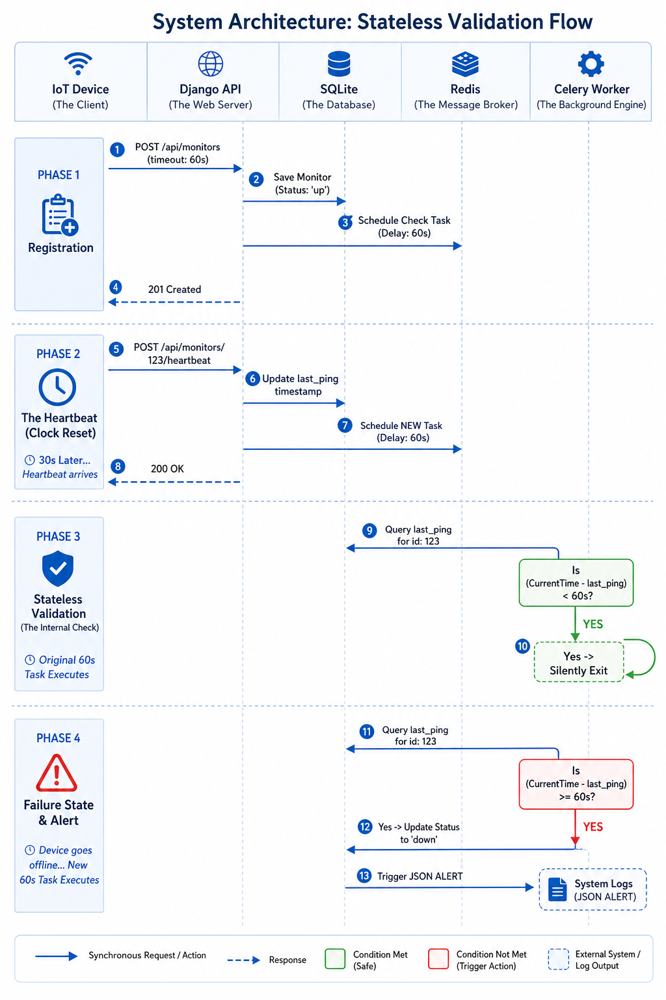

# Pulse-Check-API ("Watchdog" Sentinel)

A resilient, asynchronous Dead Man's Switch API designed to monitor remote critical infrastructure. Devices register a timeout window and send periodic heartbeats. If a device fails to ping before its timer expires, the system automatically triggers a background alert.

---

## 🏗 Architecture Diagram

The system utilizes a decoupled, stateless architecture. Instead of blocking the main thread or relying on heavy database polling (cron jobs), timeout tracking is offloaded to an asynchronous task queue (Celery) backed by an in-memory message broker (Redis).



### 📊 Understanding the Architecture Flow

The diagram above illustrates the **Stateless Validation Architecture** used to manage high-concurrency timers.

- **Registration (Steps 1–4):** The device registers its timeout window. The API saves the state and offloads the countdown to Celery via Redis, freeing up the main Django thread instantly.
- **The Heartbeat (Steps 5–8):** When a ping arrives, we simply update the `last_ping` timestamp and spawn a new delayed check — no wasted resources cancelling old tasks.
- **Stateless Resolution (Steps 9–10):** When any task executes, it compares the current time against `last_ping`. If a recent heartbeat reset the clock, the task silently exits.
- **Failure State (Steps 11–13):** If the device loses connection, the next Celery worker to execute will see the elapsed time exceeds the allowed window and trigger the system alert.

---

## 🛠 Setup Instructions

### Prerequisites

- Python 3.8+
- Redis Server installed and running

```bash
sudo apt install redis-server && sudo systemctl start redis-server
```

### Installation

1. Clone the repository and enter the directory:

```bash
git clone https://github.com/Gakwaya011/AmaliTech-DEG-Project-based-challenges.git
cd AmaliTech-DEG-Project-based-challenges
```

2. Create and activate a virtual environment:

```bash
python3 -m venv pulse
source pulse/bin/activate
```

3. Install dependencies:

```bash
pip install django djangorestframework celery redis python-dotenv
```

4. Run database migrations:

```bash
python manage.py migrate
```

### Running the Services

You will need **two terminal windows** running simultaneously.

**Terminal 1 — The API Server:**

```bash
source pulse/bin/activate
python manage.py runserver
```

**Terminal 2 — The Celery Worker:**

```bash
source pulse/bin/activate
celery -A sentinel worker --loglevel=info
```

---

## 📡 API Documentation

### 1. Register a Monitor

**`POST /api/monitors`**

Initializes a new device and starts the countdown timer.

**Request Body:**

```json
{
    "id": "device-123",
    "timeout": 60,
    "alert_email": "admin@critmon.com"
}
```

**Response `201 Created`:**

```json
{
    "message": "Monitor created successfully.",
    "data": {
        "id": "device-123",
        "timeout": 60,
        "alert_email": "admin@critmon.com",
        "status": "up",
        "last_ping": "2026-04-28T10:00:00Z"
    }
}
```

---

### 2. The Heartbeat (Reset)

**`POST /api/monitors/{id}/heartbeat`**

Resets the countdown timer for the specified device.

**Response `200 OK`:**

```json
{
    "message": "Heartbeat received for device-123"
}
```

**Response `404 Not Found`:** Returned if the device ID does not exist in the system.

---

### 3. Pause Monitoring (Snooze)

**`POST /api/monitors/{id}/pause`**

Pauses the countdown timer for a device under maintenance. No alerts will fire while paused. Sending a heartbeat automatically resumes monitoring.

**Response `200 OK`:**

```json
{
    "message": "Monitor device-123 has been paused."
}
```

---

## 🚀 Developer's Choice: The Maintenance "Snooze" Button

**Endpoint:** `POST /api/monitors/{id}/pause`

### Why I Added It

In critical infrastructure tracking, remote devices frequently undergo **scheduled maintenance**. If a technician unplugs a solar sensor for repairs, the system will immediately flag it as a catastrophic failure — causing alert fatigue for the support team.

By exposing a `/pause` endpoint, technicians can put the monitor into a `paused` state. The backend Celery workers are programmed to check for this state and bypass the alert logic entirely. The system **automatically un-pauses** the moment the device comes back online and sends its next heartbeat, ensuring zero manual intervention is required to resume protection.
